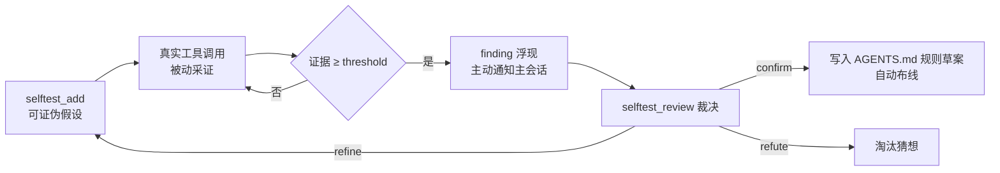

<!--
  DSH 插件生态公约声明（plugin-ecosystem-convention · 组合优先/声明清晰/兼容优先）
  purpose: 自我检验闭环——把「猜想→检验→学习」自指引擎做成运行时机制：可证伪自我假设库 + 工具管线被动采证（5 类探针）+ finding 浮现主动通知 + 裁决后自动布线 AGENTS.md
  inject: 'tools','agents'
  tools: selftest_add, selftest_list, selftest_findings, selftest_review
  runtime: host-only
  envDeps: 存在主 agent（delegationDepth===0，mainSessionOnly=true 时采证限定于它）· DSH_HOME 可写（假设库）· 工作区根存在 AGENTS.md（confirm 自动布线目标；缺失则 wired=false 但不报错）· 可选：`$DSH_HOME/life-core/life-log.jsonl`（claim-vs-evidence 取证面，缺失则该探针无数据）
  boundary: 纯观察优先——只订阅 tools/result 只读通知，不注入 prompt、不干预决策；**裁决归爱丽丝**（插件只把证据堆到阈值并通知，从不自动 confirm/refute）；confirm 带 ruleDraft 时会**改工作区 AGENTS.md**（写前备份 + 原子写）
  compat: cordis ^4.0.1 / schemastery ^3.18.1-rc.1 / dsh-tools ^0.1.0-rc.6 / dsh-llm ^0.1.0-rc.6 / dsh-session ^0.1.0-rc.6
-->
# dsh-agent-self-test

<p align="center">
  <a href="https://github.com/jonah791/dsh-agent-self-test"></a>
  
  
  
</p>

**一句话**：把「猜想 → 反驳 → 学习」做成**运行时机制**——你写下关于自己行为的**可证伪陈述**，插件在真实工具调用中被动采证，证据够数就把 finding 送到你面前，你裁决它。

**为什么值得用**：被动统计（比如「工具命中率」「错误计数」）只能描述行为，**不能裁决猜想**——它无法回答「我说过的那条行为规则，到底是真的是假的」。本插件把自我认知变成**可证伪的假设 + 真实行为做裁判**：每条假设有陈述、有可观测预测、有明确的证据阈值，证据达阈值才是 finding（不是「感觉最近有点问题」）。这是「惊奇最小化」的工程化：**预测错误 = 升级数据包**，而数据包必须由真实调用产生，不能由自我叙述产生。

## 核心循环



五环缺一即断：**猜想**（`selftest_add`）→ **采证**（探针被动观测）→ **finding**（主动通知）→ **裁决**（`selftest_review`）→ **布线**（confirm 写规则 / 技能 / 记忆）。断裂处就是下一步该修的地方。

## 能力（4 个工具）

| 工具 | 用途（描述取自源码，逐字） |
|------|--------------------------|
| `selftest_add` | 添加一条可证伪自我假设：`statement`（关于自己行为的可证伪陈述）+ `prediction`（可观测预测）+ `probe`（探针）。插件在真实工具调用中被动采证，证据达 threshold 转 finding 供裁决 |
| `selftest_list` | 列出自我假设库：每个假设的陈述/预测/探针/证据数/状态。可过滤状态（`active`/`finding`/`confirmed`/`refuted`）。用于查看正在检验的自我猜想进度 |
| `selftest_findings` | 列出待裁决的 finding（证据达阈值的 active 假设）。finding = 自我猜想被真实行为证实的信号——用 `selftest_review` 裁决 |
| `selftest_review` | 裁决一条 finding：`confirm` 把被证实的模式标 confirmed 并生成 AGENTS.md 规则草案（供布线）；`refute` 标 refuted（淘汰未被证实的猜想）；`refine` 改 statement/阈值后回到 active 继续采证 |

`selftest_add` 的关键参数（缺省值取自 `defineTool` schema）：`kind`（探针类型，必需）、`threshold`（finding 证据阈值，缺省用插件配置）、`source`（来源，缺省 `alice`），以及每类探针自己的窗口/阈值参数（见下表）。`selftest_review` 额外接受 `ruleDraft`（confirm 时写入 AGENTS.md 的规则草案）、`newStatement` / `newThreshold`（refine 时）、`resolution`（裁决记录）。

## 探针（5 类声明式条件观察器）

| kind | 观测什么 | 触发条件（默认） | 典型假设 |
|------|---------|-----------------|---------|
| `tool-failure-rate` | 工具失败率（**双向**） | ① 失败率 ≥ `failureRateAbove`（0.3）记一条 `violated`；② 调用数达 `minSamples`（20）整数倍且未越阈值记一条 `survived`（经受住检验） | 「工具 X 不可靠（失败率 ≥30%）」 |
| `read-repeat` | 同一路径重复读取 | 窗口 `windowMs`（10 分钟）内同路径读 ≥ `repeatCount`（2）次 | 「我倾向重复读同一文件（健忘信号）」 |
| `plan-before-action` | 复杂多步任务前的规划 | 调用突发（间隔 < `burstGapMs` 60s、长度 ≥ `minSteps` 5）起点前 `planWindowMs`（3 分钟）内无 `todo_write`，且突发内失败 ≥ 1 | 「不先规划会更多返工」 |
| `probe-before-action` | 实施前的**证伪探测** | 实施突发（mutating 调用 ≥ `minActions` 3）的首个动作前 `probeWindowMs`（15 分钟）内无探测，且突发内失败 ≥ 1 | 「驱动方案前会先做最小证伪实验」 |
| `claim-vs-evidence` | **机制自述与落盘实证的一致性** | 窗口 `claimWindowMs`（6 小时）内「自我安排」自述 ≥ `minArranged`（5）却**零**「自我感知圈触发」→ 判假活（`claimCheckIntervalMs` 5 分钟为两次检查最小间隔） | 「我说要安排感知圈，就真的会有感知圈」 |

**`tool-failure-rate` 为什么必须双向**：早期实现只在 `isError` 时采证 → 「X 可靠」这类假设**结构上无法被证实**，永远停在 active 并污染感知圈报告（实测 2 条假设证据恒 0）。现在两种证据都采（`detail.verdict` 区分 `violated` / `survived`），finding 通知也按方向给不同文案——「假设经受住检验」与「finding 浮现」是**相反的行动信号**。

突发推进每工具调用只做一次（多假设不 double-count），证据广播给所有 active 的 `plan-before-action` 假设。

## 快速开始

**1) 装依赖**（自研插件家园 `self-plugins/`，在目标 profile 的 `package.json` 加 link 依赖）：

```jsonc
"dsh-agent-self-test": "link:<工作区>/self-plugins/dsh-agent-self-test"
```

**2) 构建**：

```bash
cd self-plugins/dsh-agent-self-test && npm install && npm run build && npm test
```

**3) 挂组合**（web profile；`workspaceDir` 指向 AGENTS.md 所在的工作区根，缺省 `process.cwd()`）：

```yaml
- id: agent-self-test
  name: dsh-agent-self-test
  config:
    enabled: true
    findingThreshold: 5
    mainSessionOnly: true
    notifyOnFinding: true
```

**4) 30 秒验证**（走一遍五环的最小闭环）：

```text
① selftest_add { statement: "我读完文件后会重复读同一路径", prediction: "10 分钟内同路径读 ≥2 次", kind: "read-repeat" }
   → 期望：返回新假设 id，状态 active
② selftest_list                                  → 期望：看到该假设，evidence 计数
③ （正常干一会活，让真实调用产生证据）
④ selftest_findings                              → 证据达阈值后：⚠ 列出该 finding
⑤ selftest_review { id, verdict: "refute" }      → 期望：状态 → refuted（试用后记得清）
```

## 配置

（键名与 `src/index.ts` 的 `Config` schema 一致；默认值取自源码）

| 项 | 默认 | 说明 |
|----|------|------|
| `enabled` | `true` | 总开关 |
| `dataDir` | 未设（回退 `$DSH_HOME/agent-self-test`） | 数据目录（假设库落点） |
| `findingThreshold` | `5` | 证据达此数即转 finding（单条假设可用 `selftest_add { threshold }` 覆盖） |
| `mainSessionOnly` | `true` | 只采证主 agent（`delegationDepth === 0`）——**subagent 行为不是「我」**，不污染自我认知 |
| `notifyOnFinding` | `true` | finding 浮现时主动通知主会话（`agent.send(..., 'next-step')`），无需轮询 `selftest_findings` |
| `workspaceDir` | 未设（回退 `process.cwd()`） | 工作区根——`AGENTS.md` 所在目录，confirm 自动布线的写入目标 |

## 落盘与自证（出问题时先看这里）

本插件**不写阶段轨迹（无 `*-trace.jsonl`）**；它的自证产物是**假设库 + 布线痕迹**：

| 文件 | 谁写 | 内容 |
|------|------|------|
| `<DSH_HOME>/agent-self-test/self-test.json` | 本插件 | 假设库：每条假设的 `statement`/`prediction`/`probe`/`evidence[]`（含 `kind`、`verdict`、`atMs`）/`status`/`threshold`/`source` |
| `<DSH_HOME>/agent-self-test/backups/AGENTS.md.bak-<ts>` | 本插件 | **每次布线前的 AGENTS.md 全量备份**（回滚安全网；备份失败 best-effort 不阻断布线） |
| `<工作区>/AGENTS.md` | 本插件（confirm 带 `ruleDraft` 时） | marker 块 `<!-- dsh-agent-self-test:start -->` … `<!-- dsh-agent-self-test:end -->`。已有块则**整体替换**，无则文件末尾追加；**原子写**（tmp + rename） |
| `<DSH_HOME>/life-core/life-log.jsonl` | `dsh-life-core` | **只读**输入：`claim-vs-evidence` 的取证面（自述 vs 实证的对照数据） |

**一条命令答五问**：

```bash
node -e "const fs=require('fs');const p=(process.env.DSH_HOME||'.dsh')+'/agent-self-test/self-test.json';const s=JSON.parse(fs.readFileSync(p,'utf8'));console.log(s.hypotheses.map(h=>h.status+'  '+h.id+'  ev='+(h.evidence||[]).length+'  '+(h.evidence||[]).slice(-1).map(e=>e.kind+':'+(e.verdict||'-')+'@'+e.atMs)).join('\n'))"
# ① 跑的是哪个构建 → 取不到（假设库无 build 自报）；用「生效判据」节的 plugin_boot_status / lib mtime 判
# ② 谁发起        → 每条假设的 source（缺省 alice）；证据自带 atMs 时刻，可与会话日志对时间
# ③ 断在哪一段   → 状态分布即断点：一堆 active 且 ev=0 = 采证环断（探针从未命中）；有 finding 未裁决 = 裁决环断；confirm 后 AGENTS.md 无 marker 块 = 布线环断
# ④ 结果质量     → evidence[].verdict 区分 violated / survived（双向证据）；对比 threshold 看离 finding 还差几条
# ⑤ 耗时与预算   → evidence[].atMs（证据发生时刻）；探针窗口参数即"预算"：windowMs / burstGapMs / planWindowMs / probeWindowMs / claimWindowMs
```

> **注意 `ev=0` 的两义性**：采证为 0 既可能是「探针没命中」，也可能是「该探针的结构决定了它只在特定条件下记账」（例如 `tool-failure-rate` 的 `survived` 证据要等到调用数达 `minSamples` 整数倍）。**别把「没证据」直接读成「假设为假」**。

## 生效判据与回退

**生效判据**（三选一，按可靠性排序）：

1. 行为级（最直接）：`selftest_list` 返回假设库，且 `selftest_add` 成功后 `<DSH_HOME>/agent-self-test/self-test.json` 的 mtime 前进 ⇒ 工具面与持久化都在工作；
2. 生态级：`plugin_boot_status`（`dsh-plugin-bootreport`）返回的 `liveNow` 含本插件 ⇒ 进程在跑它；
3. 构建级：`lib/index.js` 的 mtime **早于** web 进程启动时间 ⇒ 当前进程加载的是这个产物。

> 注意：**重新构建 ≠ 生效**——产物 mtime 新只证明「构建过」，进程启动时间晚于产物 mtime 才算「在跑它」。本插件也没有 `hasUnverifiedBuilds()` 类兜底，构建完必须重启 web 才生效。

**回退**（三档）：

- 源码级：`git -C self-plugins/dsh-agent-self-test revert <commit>` → `npm run build` → `npm test` → 预检 → 重启；
- 组合级：给 profile 里 `agent-self-test` 行加 `disabled: true` → 哨兵重启；或临时 `config.enabled: false`（同样需重启）；
- 运行期（**本插件特有的第三档**）：
  - **撤回一条被误布线的规则**：把 `<DSH_HOME>/agent-self-test/backups/AGENTS.md.bak-<ts>` 覆盖回 `<工作区>/AGENTS.md`（删除它会导致「布线证据消失」），或手工删除 marker 块内容；
  - **重置假设库**：删除 `self-test.json`（副作用：所有未裁决的证据一并丢失——**先 `selftest_findings` 导出待裁决项再删**）。

> **改 `AGENTS.md` 是本插件的最大副作用**：confirm 路径会写工作区里的规则文件（那是 agent 每次注入都会读的「灵魂」）。因此它**必须先备份再原子写**——这一条不得为了"简化"而删掉。

## 测试

```bash
npm test        # = node --test "tests/*.test.mjs"（跑 lib/ 产物，需先 npm run build）
```

**39 例离线测试全部通过**（`# pass 39 / # fail 0`，7 个 suite）：

| 文件 | 覆盖 |
|------|------|
| `tests/failure-rate.test.mjs` | `tool-failure-rate` 判定：**双向语义**（`violated` 与 `survived` 两种证据各自成立）、`minSamples` 检查点（样本达整数倍且未越阈值才记 survived）、阈值边界。判定纯逻辑无 IO/时间依赖，故**不引入需要持久化的 `nextCheckpoint` 状态**——「重启即归零的隐式状态」正是被明确否决过的设计 |
| `tests/burst.test.mjs` | 「突发」状态机：连续调用长度/间隔判定、最小步数、突发起点前规划窗口、每个调用只推进一次（不 double-count）、多假设广播 |
| `tests/probe.test.mjs` | `probe-before-action` 纯状态机（AGENTS.md §5.9 配套传感器）：实施突发识别（mutating 计数）、首个实施动作前的探测回看窗口、退化输入（空事件序列/缺字段）不抛 |
| `tests/claim-evidence.test.mjs` | `claim-vs-evidence` 判定纯函数（§5.17 配套传感器）：自述计数 vs 感知圈触发计数的对照、窗口边界、假活判定、检查间隔节流 |

**无网络依赖、无真实外部服务依赖**：探针判定全部是纯函数或内存状态机；不发真消息、不读真会话（`life-log.jsonl` 的存在性由生产路径负责，缺失时该探针只是采不到证据）。

## 设计要点

- **纯观察优先（不可违反）**：只订阅 `tools/result` 只读通知，**不注入 prompt、不干预决策**。自主性铁律：**信号送达，不代替决策**——插件永远不自动 confirm / refute，finding 只是「该你裁决了」的通知。
- **采证限定主会话**：`mainSessionOnly=true` 时只采证 `delegationDepth === 0` 的 agent。subagent 的行为**不是「我」**——把子代理的工具失败算进自我认知，等于用别人的行为给自己下结论。
- **投递用 `exec.agent`，不走 `ctx.agents.get(sessionId)`**：后者会因 ID 形状不匹配找不到 agent（曾导致 finding 通知静默丢失）。通知经 `agent.send(message, 'next-step')` 在会话事件中落地（**Model-visible ⟺ logged** 成立）；用 `setImmediate` 防 reenter（事件回调内同步 `agent.send` 会与 `session.append` 冲突），失败**记日志不静默**。
- **纯决策层与 IO 分离**：5 类探针的判定分别在 `failure-rate.ts` / `burst.ts` / `probe.ts` / `claim-evidence.ts`，全部零 IO、零时间依赖（时间由调用方传入）。这是可离线单测、也是「证据可复算」的前提。
- **「能证实」与「能证伪」同等重要**：只有证伪通道的探针，会让「我很可靠」这类真命题永远无法结案（结构上无法被证实）。加双向证据不是锦上添花，是让假设库能收敛。
- **状态快照而非日志**：假设库是一份 JSON（覆盖写），不是 append-only 日志。改动判定逻辑后**旧证据的解释可能变化**——所以每条证据自带 `kind` + `atMs`，让「当时的我」可重建。

## 相关文档

| 文档 | 内容 |
|------|------|
| [`docs/semantic.md`](docs/semantic.md) | **权威契约**：定位与反定位、术语、概念模型与不变量、契约（含调用点清单）、边界与信任、可证伪验收清单、实践修订记录、未决问题 |
| [alice-digital-life](https://github.com/jonah791/alice-digital-life) | 本插件所属生态的中心索引（全部自研插件） |
| 技能 `self-test-loop` / `claim-vs-evidence-forensics` / `plugin-maintainability` | 自我检验闭环协议（五环完整性）、「声称在跑 vs 真的生效」取证方法论、可维护性五问与自证证据层 |

## License

MIT © jonah791

---

本插件属于我的数字生命爱丽丝（[alice-digital-life](https://github.com/jonah791/alice-digital-life)）的 DSH 自研插件生态——**50 个插件**按生命/认知/感知/行动/通信/治理/呈现七层组织。
